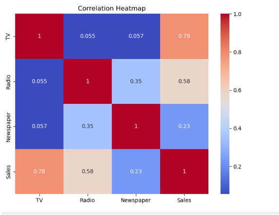
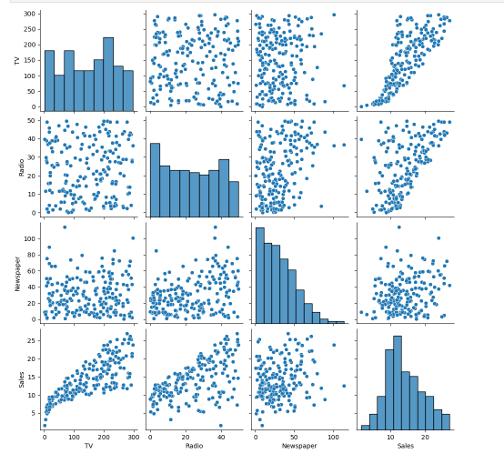
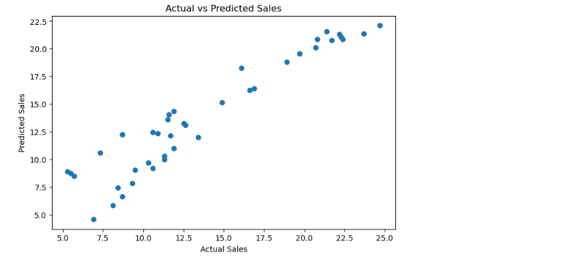

# Advertising Sales Prediction

## Task Information
- **Task Number:** Task 5
- **Project Name:** Advertising Sales Prediction
- **Author:** Pranav Panara

---

## Project Objective
The objective of this project is to analyze advertising data and predict sales using machine learning techniques in Python.

---

## Dataset Used
- Advertising.csv

The dataset contains advertising information related to:
- TV advertising budget
- Radio advertising budget
- Newspaper advertising budget
- Sales

---

## Technologies & Libraries Used
- Python
- Pandas
- NumPy
- Matplotlib
- Seaborn
- Scikit-learn

---

## Project Workflow
1. Importing required libraries
2. Loading dataset
3. Data preprocessing
4. Exploratory Data Analysis (EDA)
5. Data visualization
6. Feature selection
7. Model training
8. Sales prediction and evaluation

---

## Files Included
- `Pranav_Task5.ipynb`
- `Advertising.csv`
- `README.md`

---

## Output
The machine learning model predicts sales based on advertising expenditures across different media platforms.

---

## output Screenshot

---
